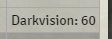
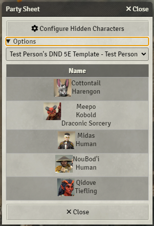

# Template System JSON Documentation

Examples can be found in the [example_templates](https://github.com/EddieDover/Theater-of-the-Mind/example_templates) folder.
Place templates in the <FOUNDRY_VTT/Data/totm/> folder.

## Required Minimal Top Level Structure

```json
{
  "name": <YOUR_TEMPLATE_NAME>,
  "system": <YOUR_TEMPLATE_SYSTEM>,
  "author": <YOUR_NAME>,
  "rows": [] // See Below Section For Details
}
```

***Note**: Templates will be displayed to the user as 'YOUR_TEMPLATE_NAME - YOUR_NAME' and only if the system matches the current system in use.*

### Optional Top Level Properties

The following properties are also available at the top level of the system structure.

  **offline_excludes_property** - string - This is optional and defaults to the actor.type. Only override if needed. All overrides are treated as if their parent object is the character.

  **offline_excludes** - array - This is optional and defaults to ["npc"]. Any object inside the exclusion list that matches the value of the offline_excludes_property will be excluded from showing in the party list.

  **offline_includes_property** - string - This is optional but required both it and **offline_includes** are required to work, if used.It has no default property. It will be treated as if its parent object is the character. If you use this, offline_excludes_property/offline_excludes will be ignored.

  **offline_includes**: array - This is the same as **offline_excludes** but it is an inclusion list.

### Row Specific Structure

The "rows" property must contain an array of an array of column data.

``` "rows": [] ``` is empty

``` "rows": [ [] ] ``` will contain one row

``` "rows": "[ [], [] ]``` will contain two rows.

Inside the row array, the plugin expects items in the following format:
```json
{
  "name": <COLUMN_NAME>,
  "type": <DATA_TYPE>,
  "coltype": <COLUMN_TYPE>,
  "value": <DATA_VALUE>
}
```

__Each item corresponds to a single column on the sheet. If you have multiple rows, then each row must have the same number of columns.__ See the below Examples section for more examples.

### Primary Property Specifics

**name** - This can be any value you wish. If the coltype is "show" then it will be displayed as the column header.

**type** - This is the type of data being displayed, possible choices are:
  * **direct** - This will process the text in the **value** property and parse out any string sections to see if they are properties of the character.
  * **direct-complex** - This will expect the **value** property to contain an array of complex types. See documentation below.
  * **string** - This will simply display the text in the **value** property without modification.
  * **array-string-builder** - This will accept a **value** property in the following format: **<array_object> => <sub_property_string>** See examples below for more information
  * **charactersheet** - This will display the character sheet in the column, ignoring anything in the **value** property.

**coltype** - This property controls if the column text is displayed as a header in the generated table. It accepts either 'show' or 'skip'.
  * **show** - Show the column as a **header** column.
  * **skip** - Do NOT Show the column as a **header** column.

**maxwidth** - This _optional_ property controls the maximum width of the column. Value must be a number that represents the width in pixels. `"maxwidth": 200,`

**minwidth** - This _optional_ property controls the minimum width of the column. Value must be a number that represents the width in pixels. `"minwidth": 100,`

**value** - This property is either a **string** or an **array** of objects based on if you're using **direct-complex** or not. See examples below.

### Value - Special Keywords

There are a few special keywords that must be surrounded by { } marks, to allow easier formatting. They are as follows:

  * newline - Adds a linebreak to the text rendered.
  * charactersheet - Inserts a clickable image of the character that will open their character sheet.

### Direct-Complex Object

The direct complex object was originally created to show values for attributes but only if they existed. It was originally used for the DND5E Senses display.

A direct complex object has three properties:
* type - The type of object. Currently accepted values are:
    - "exists" - Does the **value** exist or not. If using **exists** it will look for an _OPTIONAL_ property named **else** and if the thing you're checking for doesn't exist, the value of **else** will be parsed. You may leave **else** out if not using it.
    ```json
        {
          type: "exists",
          value: "system.attribute.isplayersick",
          text: "Player is sick with system.attribute.sickness"
          else: "Healthy for system.attribute.daysSinceSick days"
        },
    ```
    - "match" - Checks for an additional **match** property. If the **value** matches the **match** property, then **text** is processed.
    - "match-all" - Same as match, but the **value** can be an array of properties to match against.
* value - The attribute that you're checking against
* text - The text to be displayed if the **type** check passes. It will be processed in the same manner as the **value** is processed on a standard **direct** column type.

```json
{
  "name": "Senses",
  "type": "direct-complex",
  "coltype": "skip",
  "value": [
    {
      type: "exists",
      value: "system.attributes.senses.darkvision",
      text: "Darkvision: system.attributes.senses.darkvision"
    },
    {
      type: "exists",
      value: "system.attributes.senses.blindsight",
      text: "Blindsight: system.attributes.senses.blindsight"
    },
    {
      type: "exists",
      value: "system.attributes.senses.tremorsense",
      text: "Tremorsense: system.attributes.senses.tremorsense"
    },
    {
      type: "exists",
      value: "system.attributes.senses.truesight",
      text: "Truesight: system.attributes.senses.truesight"
    },
    {
      type: "exists",
      value: "system.attributes.senses.special",
      text: "Special: system.attributes.senses.special"
    }
  ]
}
```

In this example, the system will contain one column named Senses, but the column name will be hidden (skipped). It will then loop through each item in the **value** field. In this case, it will check each of the dnd5e system senses. If they exist on the character, then the text will be displayed, formatted as a **direct** line, and all appended together at the end.

In this example, the following character only has one sense that exists, so it's the only one displayed:




Here's an example of how to use **match**:
```json
		{
		 	"name": "Career",
			"align": "center",
			"type": "direct-complex",
			"coltype": "hide",
			"value": [
				{
					"type": "match",
					"match": "1",
					"value": "system.general.career",
					"text": "Colonial Marine"
				},
				{
					"type": "match",
					"match": "8",
					"value": "system.general.career",
					"text": "Pilot"
				}
			]
		},
```

In this example, the system will contain a column named Career, but the column name will be hidden (skipped). It will then loop through each item in the **value** field. In this system `Alien RPG`, the player's career is a number, stored in `system.general.career`. In this example, if the value in `system.general.career` matches `1` then the value `Colonial Marine` is output, otherwise, if the career matches `8` then the value `Pilot` is output. Any items who's **match** is the same as the contents of **value** will be displayed.


## Examples

### Extremely Basic File Example
Code:
```json
{
    "name": "Test Person's DND 5E Template",
    "system": "dnd5e",
    "author": "Test Person",
    "rows" : [
        [
            {
                "name": "Name",
                "type": "direct",
                "coltype": "show",
                "value": "{charactersheet} name {newline} system.details.race"
            }
        ]
    ]
}

// Note that this uses both the charactersheet and newline special keywords.
```
Result:


